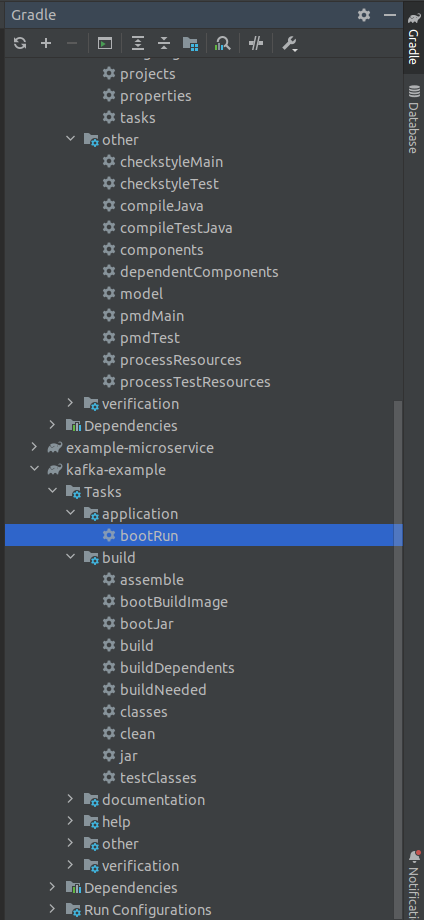
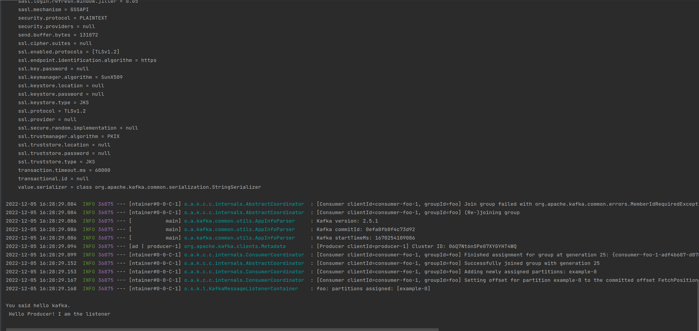
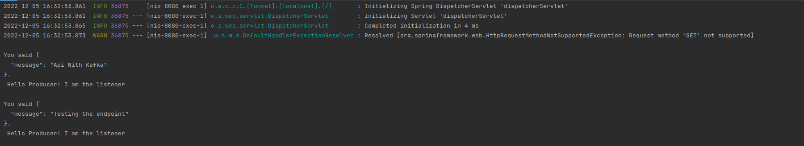

## Kafka Example Documentation

This microservice was made with the purpose of demonstrating how the spring.kafka api 
works. It is just an example of how the main constructs can be used, and was made with
guidance from this [tutorial](https://www.youtube.com/watch?v=SqVfCyfCJqw&t=885s).

Main key points from the structure.

### Docker
Note that in this microservice there a file with name *docker.compose.yml*. This is
the file where that specifies the docker containers needed for the operation, namely
*zookeeper* and *kafka*. For you to run this file, and as a consequence the microservice,
you need to have Docker installed. After doing that, you can run this file with
the command `sudo docker-compose -f docker-compose.yml up` (for linux...). This command 
will essentially activate the broker, so that the project can make use of kafka.

### Kafka
Note that in the *docker.compose.yml* and the *build.gradle* there is no version of kafka
specified. I did this as before, when I was specifying the version of kafka, there were
some conflicts in the communication between the Application and the broker.

### Spring

Note that I removed the *spring.security* from the *build.gradle* file as it was not
letting me test the *PostMapping*. Another thing to note is the *application.properties*
file, which has the declaration `spring.kafka.bootstrap-servers=localhost:9092` so that
the application can connect to the running broker.

## Running

To run this microservice, you first should run the command mentioned in the docker section, so
that the broker is active. Then  you should target the task `kafka-example bootRun`,
or if you want to do it in gradle, you can click on the following.

You should observe, after running this task the following output.

If you see those last few lines, it means that a producer published a message in a topic 
(in this case called `example`), and a listener to that topic observed it, and took action
based on it! You can observe the code that does that in the main package.

The last piece of functionality of this microservice is the `PostMapping` you can find 
on the *MessageRequest*, and target with the respective endpoint. If you do that you
should get the following output.

## Wrap Up

This is all the functionality of this microservice, and I think it provides the basics of communication
over kafka. We should all get a bit more acquainted with how kafka works and how does its [spring
api](https://spring.io/projects/spring-kafka) works. This example is just to serve us so we can
build the other microservices and see how we should implement the structures. Another important
thing in this microservice is the *setup*. I went through a lot of problems that were due to 
incompatible versions, and then I sorted out. So if we encounter problems in future microservices
due to kafka-related packages (and their versions) we can refer to this code.

It is still worth noting that following this [tutorial](https://www.youtube.com/watch?v=SqVfCyfCJqw&t=885s) 
was very useful, as well as this website that Hubert [sent](https://medium.com/geekculture/how-to-kafka-your-microservices-9ef45a9e882a)git
